# Task Report

## Question 1 (Signed Shift-Right Multiplier)
> Test Cases Output
- 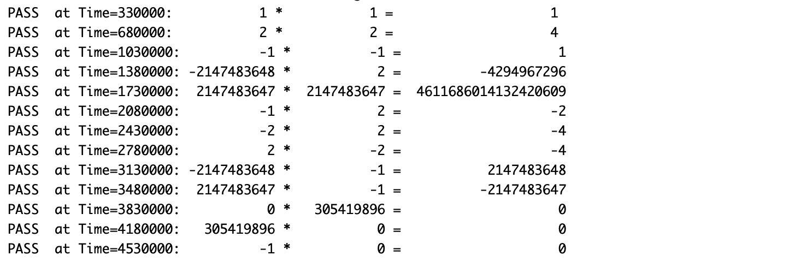

> Wave
- 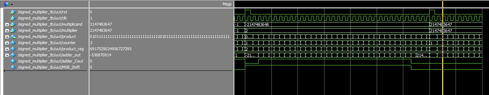

> Analysis and Resources Usage
- 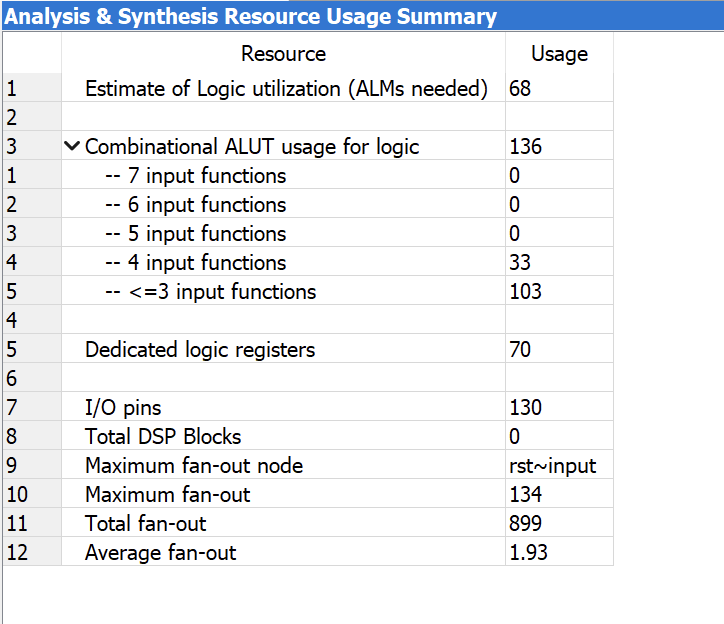

> Timing Analysis
- 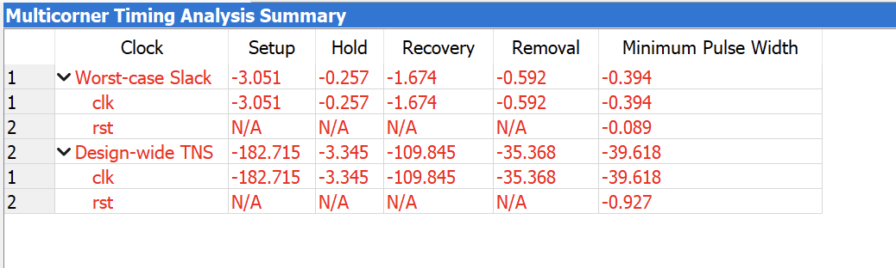

> Progagation Delay
- 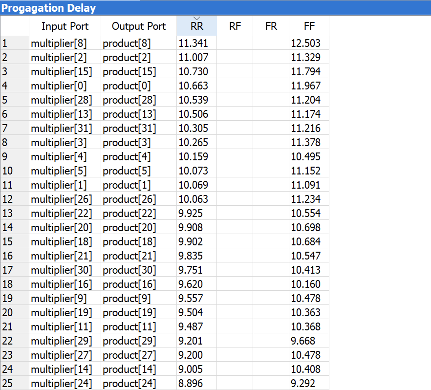

## Question 2 (Signed Radix-8 Multiplier)
> Test Cases Output
- 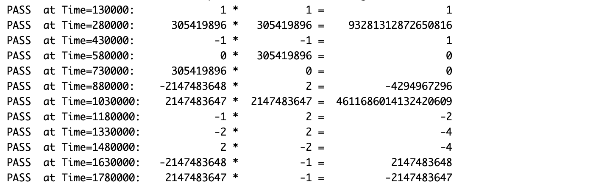

> Wave
- 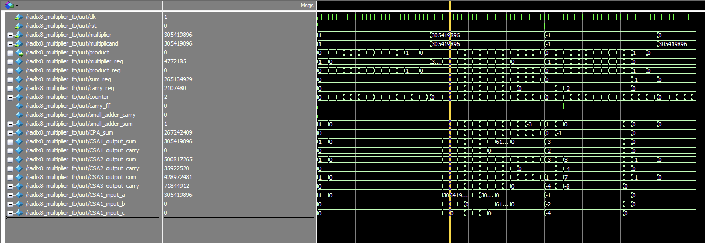

> Analysis and Resources Usage
- 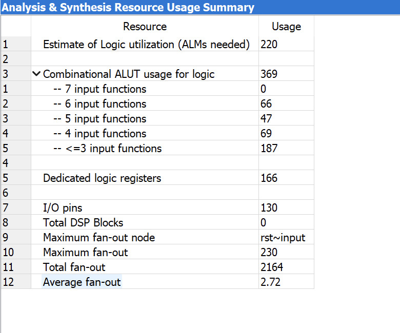

> Timing Analysis
- 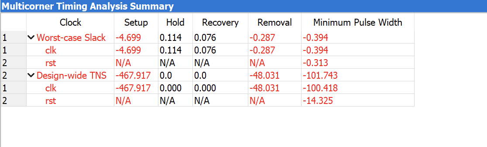

## Question 3 (Signed Array Multiplier)
> Test Cases Output
- 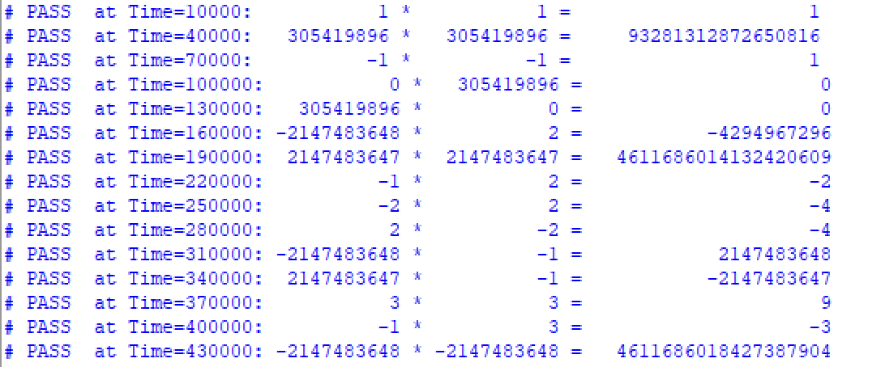

> Wave
- 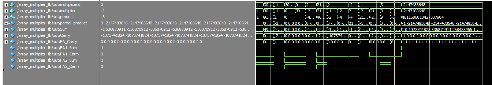

> Analysis and Resources Usage
- 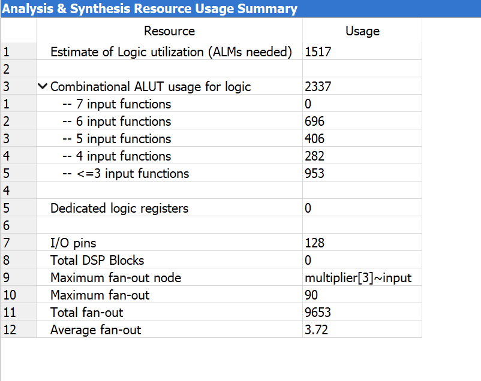

> Progagation Delay
- 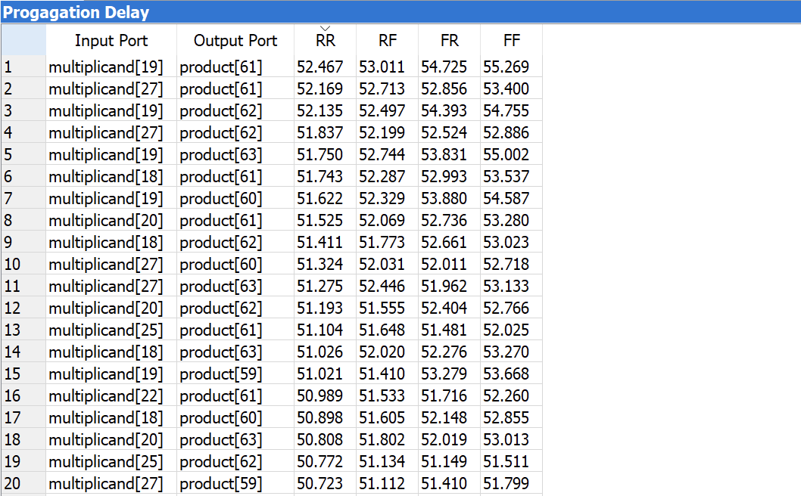
